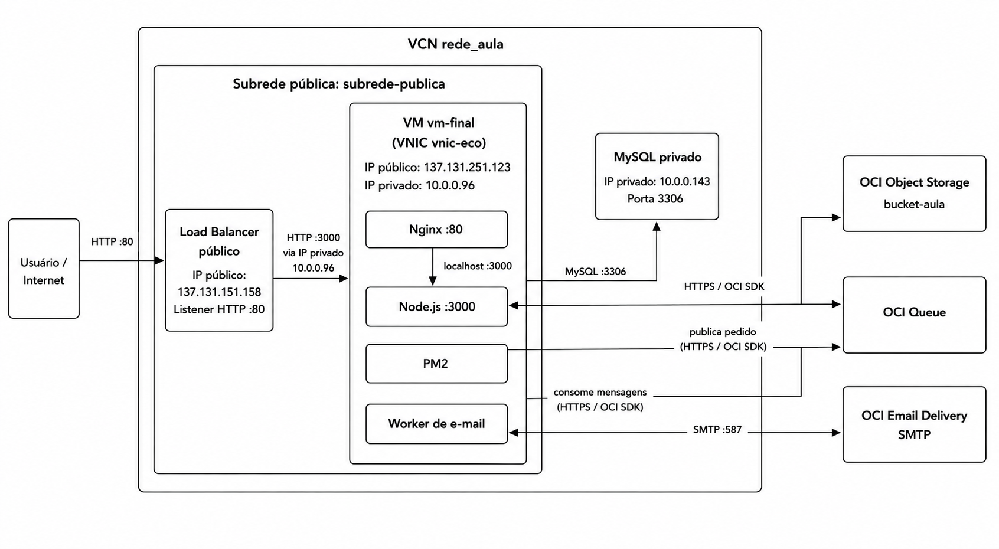

# E-commerce Cloud — OCI

E-commerce full stack desenvolvido com Node.js e implantado sobre serviços da **Oracle Cloud Infrastructure (OCI)**.

O projeto combina uma aplicação web tradicional com infraestrutura de nuvem, banco gerenciado, armazenamento de objetos, fila assíncrona e envio de e-mails.

## Arquitetura



Fluxo principal:

```text
Usuário
  ↓
OCI Load Balancer
  ↓
Compute VM → Nginx → Node.js / Express / EJS
                    ├── OCI MySQL Database Service
                    ├── OCI Object Storage
                    └── OCI Queue → Worker → OCI Email Delivery
```

## Funcionalidades

- vitrine pública de produtos
- autenticação
- painel administrativo
- gerenciamento de produtos
- gerenciamento de marcas e categorias
- gerenciamento de usuários
- gerenciamento de pedidos
- upload e armazenamento de imagens
- processamento assíncrono de eventos de e-mail
- endpoint `/health` para monitoramento

## Stack

- Node.js
- Express
- EJS
- MySQL
- OCI Compute
- OCI Load Balancer
- OCI MySQL Database Service
- OCI Object Storage
- OCI Queue
- OCI Email Delivery
- Nginx
- PM2

## Executando localmente

```bash
npm install
cp .env.example .env
npm start
```

O worker de e-mail pode ser executado separadamente:

```bash
npm run worker:email
```

## Deploy

O passo a passo de infraestrutura, Nginx, firewall e PM2 está em [`docs/deploy-oci.md`](./docs/deploy-oci.md).

A definição da arquitetura em Mermaid está disponível em [`docs/infraestrutura-oci.mmd`](./docs/infraestrutura-oci.mmd).
